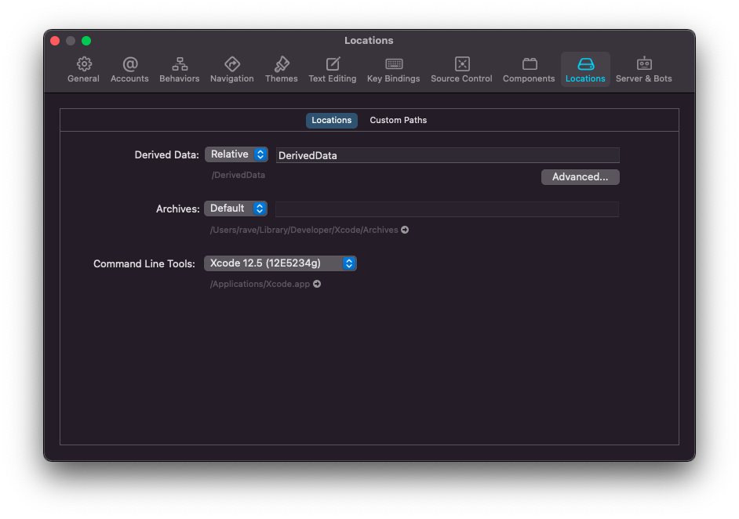
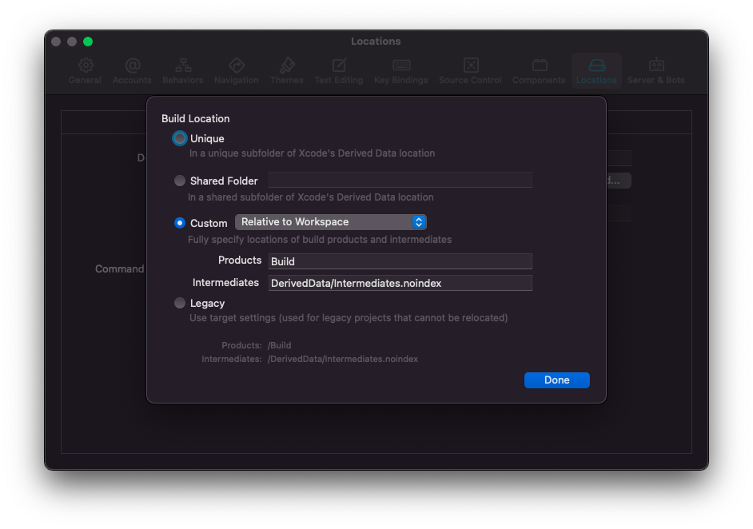

# Ray tracing in OpenGL

Hello there! Mac port brought to you by [@Ubsefor](https://github.com/Ubsefor) with the incredible help of [@Einsich](https://github.com/Einsich) of explaining the sources

Imgui, unfortunately, has been butchered, long live Imgui...

(But I actually left the imgui sources intact and made the code commented, in case anyone has spare time to deal with its mess)

### Install necessary libraries:

You require the OpenGL framework (I suggest compiling it from sources, as the shaders use version 4.1: [instructions](https://riptutorial.com/opengl/example/21105/setup-modern-opengl-4-1-on-macos--xcode--glfw-and-glew-); additionally: `brew install glfw`)

You also require the SDL2 library: `brew install sdl2`

And, lastly, GLEW: `brew install glew`

Additionally, you may need llvm, but I do believe it compiles just fine with Apple Clang...

### Building & Running:

First of all, you should set up your Xcode as in the pictures: 

 

and 

If you don't want to do that – you need to reconfigure paths to Shaders and source code of the project in [Application/config.cpp](OpenGLTemplate/Application/config.cpp)
Build the project by opening project file or via terminal, using command `xcodebuild -target OpenGLTemplate -scheme Release`, or any other configuration you may find yourself in need of.

The compiled binary, if you set up xcode as it is in this Readme, should be located in `Build` folder in the repo root.

You can run it from the terminal, or by double-clicking the executable from Finder.

